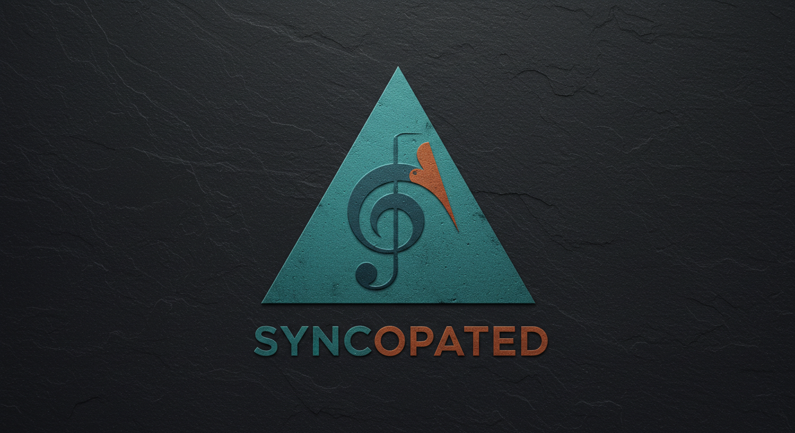

  

## Test Pilot Framework for VFX/Animation Studio Workstation Management

Syncopated is an experimental framework designed to address the complex challenges of managing Linux workstations in VFX and Animation studio environments. Through automated provisioning and standardized configuration management, this project serves as a testing ground for developing scalable solutions for studio pipeline infrastructure.

### Current Test Implementation (Arch Linux)

The framework currently operates as a proof-of-concept using Arch Linux, consisting of two integrated components:

- **syncopated-iso**: Custom ISO builder creating specialized Live/Rescue media with VFX-focused tooling
- **syncopated-ansible**: Comprehensive automation playbook handling workstation provisioning from bare metal to production-ready state

This test environment validates approaches to:

- **Automated Deployment**: Zero-touch workstation setup reducing IT overhead
- **Configuration Standardization**: Consistent environments across artist workstations
- **Pipeline Integration**: Pre-configured tools for content creation workflows
- **Scalability Testing**: Framework patterns applicable to studio-scale deployments

### Target Production Framework (Rocky Linux)

Lessons learned from the Arch Linux implementation will inform development of a production-ready framework based on Rocky Linux, designed specifically for:

- Enterprise studio environments requiring RHEL compatibility
- Integration with industry-standard pipeline tools (Maya, Houdini, Nuke, etc.)
- Centralized management of heterogeneous workstation fleets
- Compliance with studio security and audit requirements

### Key Automation Areas

- **Base System Configuration**: Networking, security, user management
- **Desktop Environment**: Optimized UI/UX for creative workflows
- **Development Tools**: Programming languages, version control, debugging
- **Content Creation**: Professional audio/video processing, 3D rendering
- **Containerization & Virtualization**: Isolated environments for different projects
- **Pipeline Integration**: Studio-specific tools and workflow automation

This experimental approach enables rapid iteration and validation of workstation management strategies before implementing enterprise-scale solutions.

## 🤝 Contributing

Contributions are welcome. Please fork the repository, create a feature branch, make your changes, and submit a Merge Request.

## 📜 License

This project is primarily licensed under the GPL-2.0 license, with some components using MIT for AI-related code.
